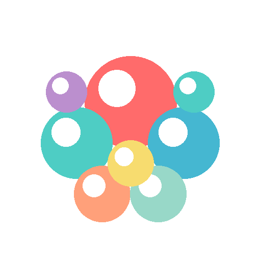

# 🫧 解压泡泡龙 - Relaxing Bubble Game

<div align="center">


**一款基于鸿蒙系统的休闲解压小游戏**

[功能特性](#功能特性) • [快速开始](#快速开始) • [游戏玩法](#游戏玩法) • [项目结构](#项目结构)

</div>

---

## 📖 项目简介

解压泡泡龙是一款专为鸿蒙系统开发的休闲解压游戏。玩家通过点击消除屏幕上的彩色泡泡来获得积分，游戏包含闯关模式、积分系统、商店系统等丰富功能，帮助玩家在忙碌的生活中放松心情。

## 📱 应用预览

<div align="center">

### 应用图标



**解压泡泡龙应用图标**

### 应用截图


**应用界面展示**

</div>

### 🎮 游戏功能展示

#### 核心游戏玩法
- **动态泡泡运动**：泡泡会在游戏区域内持续移动和浮动
- **碰撞反弹**：泡泡碰到边界会自动反弹，保持运动状态
- **点击消除**：点击泡泡获得积分，触发爆炸粒子效果
- **实时反馈**：积分、时间、关卡信息实时更新显示

#### 游戏界面元素
| 界面元素 | 功能说明 |
|---------|---------|
| 🫧 **泡泡区域** | 350x500像素的游戏画布，泡泡在其中自由移动 |
| 📊 **信息栏** | 显示当前关卡、目标分数、实时得分、剩余时间 |
| ⏱️ **倒计时** | 60秒倒计时，时间不足10秒时红色警告 |
| 🎯 **目标分数** | 达到目标分数即可通关，显示"结算"按钮 |
| 💫 **粒子效果** | 点击泡泡时产生爆炸粒子动画 |
| 🛠️ **道具栏** | 游戏进行时显示可用道具，点击即可使用 |

#### 泡泡运动特性
- **移动速度**：每个泡泡有独立的移动速度（3-7像素/帧）
- **随机方向**：泡泡以随机角度开始移动
- **边界反弹**：碰到游戏区域边界自动反弹
- **浮动效果**：在移动基础上叠加正弦波动效果
- **持续运动**：泡泡在游戏开始前就开始运动，点击开始后继续移动

### 功能界面展示

| 功能模块 | 说明 |
|---------|------|
| 🏠 **主界面** | 显示游戏标题、玩家信息（积分、金币）、开始游戏、关卡选择、商店入口 |
| 🎮 **游戏界面** | 泡泡游戏区域、实时积分显示、倒计时、当前关卡信息、暂停按钮 |
| 🎯 **关卡选择** | 20个关卡网格布局、显示通关状态、星级评价、目标分数 |
| 🛒 **道具商店** | 5种道具展示（双倍积分、时间延长、磁铁、炸弹、护盾）、价格和效果说明 |
| ⚔️ **装备升级** | 5种装备升级选项、当前等级、升级费用、效果预览 |
| 🏆 **游戏结果** | 通关/失败提示、获得积分和金币、星级评价、重玩/返回按钮 |

> 💡 **提示**：完整的功能截图请参考 [docs/SCREENSHOTS.md](docs/SCREENSHOTS.md) 文档说明。如需添加实际截图，请将图片放入 `docs/screenshots/` 目录。

## ✨ 功能特性

### 🎮 核心玩法
- **点击消除**：点击彩色泡泡获得积分
- **动态生成**：泡泡会持续生成，保持游戏节奏
- **时间挑战**：在限定时间内达成目标分数

### 🏆 闯关系统
- **20个关卡**：难度递增的关卡设计
- **目标分数**：每关有不同的目标分数要求
- **时间限制**：关卡越高，时间越紧张
- **通关奖励**：成功通关获得金币奖励

### 💰 积分与金币系统
- **积分统计**：记录总积分和最高分
- **金币获取**：消除泡泡获得金币
- **数据持久化**：游戏进度自动保存

### 🛒 商店系统
#### 道具商店
| 道具 | 效果 | 价格 |
|------|------|------|
| ⚡ 双倍积分卡 | 30秒内获得双倍积分 | 100金币 |
| ⏰ 时间延长 | 增加15秒游戏时间 | 80金币 |
| 🧲 磁铁 | 自动吸引附近泡泡 | 150金币 |
| 💣 炸弹 | 消除屏幕上所有泡泡 | 200金币 |
| 🛡️ 护盾 | 保护一次失误 | 120金币 |

#### 装备升级
| 装备 | 效果 | 基础价格 |
|------|------|----------|
| 📊 积分加成 | 提升基础积分获取 | 200金币 |
| 💰 金币加成 | 提升金币获取量 | 180金币 |
| 🔍 泡泡大小 | 增加泡泡显示大小 | 150金币 |
| ⏱️ 时间延长 | 增加关卡时间限制 | 250金币 |
| 🔥 连击加成 | 提升连击积分倍率 | 300金币 |

## 🚀 快速开始

### 环境要求
- DevEco Studio 4.0 或更高版本
- HarmonyOS SDK 6.0.2(22) 或更高版本
- Node.js 14.x 或更高版本

### 安装步骤

1. **克隆项目**
```bash
git clone https://github.com/yourusername/relaxing-bubble-game.git
cd relaxing-bubble-game
```

2. **打开项目**
- 启动 DevEco Studio
- 选择 "Open Project"
- 选择项目根目录

3. **同步依赖**
```bash
ohpm install
```

4. **运行项目**
- 连接鸿蒙设备或启动模拟器
- 点击运行按钮或使用快捷键运行

### 构建APK
```bash
# Debug版本
hvigorw assembleHap --mode module -p product=default

# Release版本
hvigorw assembleHap --mode module -p product=default -p buildMode=release
```

## 🎯 游戏玩法

### 基本操作
1. 点击"开始游戏"进入游戏
2. 在游戏区域内点击彩色泡泡
3. 每个泡泡显示积分值，点击后获得对应积分
4. 在时间结束前达到目标分数即可通关

### 进阶技巧
- **优先点击高分泡泡**：泡泡上显示的数字越大，积分越多
- **合理使用道具**：在关键时刻使用道具可以事半功倍
- **升级装备**：长期投资装备升级可以获得更高收益
- **挑战高关卡**：高关卡虽然难度大，但奖励也更丰厚

### 关卡说明
- **关卡1-5**：新手关卡，熟悉游戏操作
- **关卡6-10**：进阶关卡，需要一定技巧
- **关卡11-15**：挑战关卡，考验反应速度
- **关卡16-20**：大师关卡，需要策略和道具配合

## 📁 项目结构

```
entry/src/main/ets/
├── common/              # 公共资源
├── components/          # 组件
│   └── GameCanvas.ets   # 游戏画布组件
├── models/              # 数据模型
│   └── GameModels.ets   # 游戏数据模型定义
├── pages/               # 页面
│   ├── Index.ets        # 主入口
│   ├── GamePage.ets     # 游戏主页面
│   ├── LevelSelectPage.ets  # 关卡选择页面
│   └── ShopPage.ets     # 商店页面
└── utils/               # 工具类
    └── GameDataManager.ets  # 游戏数据管理器
```

## 🛠️ 技术栈

- **开发语言**：ArkTS (TypeScript扩展)
- **UI框架**：ArkUI 声明式UI
- **状态管理**：@State、@Prop 装饰器
- **数据持久化**：JSON序列化
- **构建工具**：Hvigor

## 🎨 设计理念

### 视觉设计
- 采用柔和的渐变色彩，营造轻松氛围
- 泡泡使用高饱和度颜色，视觉冲击力强
- 圆角和阴影设计，增强立体感

### 交互设计
- 简洁的操作方式，降低学习成本
- 即时反馈机制，点击泡泡立即消失
- 流畅的页面切换动画

### 游戏平衡
- 关卡难度曲线平滑递增
- 金币获取与消耗平衡
- 装备升级成本指数增长，避免过早满级

## 📊 性能优化

- **按需渲染**：使用ForEach优化列表渲染
- **状态最小化**：精确控制状态变量范围
- **内存管理**：及时清理定时器和事件监听
- **资源优化**：使用矢量图标替代图片资源

## 🔧 扩展开发

### 添加新道具
在 `GameDataManager.ets` 的 `initItems()` 方法中添加：
```typescript
new Item(6, '新道具', '道具描述', 100, 'new_effect', 20)
```

### 添加新装备
在 `GameDataManager.ets` 的 `initEquipments()` 方法中添加：
```typescript
new Equipment(6, '新装备', '装备描述', 200, 0.15)
```

### 添加新关卡
修改 `initLevels()` 方法中的关卡生成逻辑

## 🤝 贡献指南

欢迎提交 Issue 和 Pull Request！

1. Fork 本仓库
2. 创建特性分支 (`git checkout -b feature/AmazingFeature`)
3. 提交更改 (`git commit -m 'Add some AmazingFeature'`)
4. 推送到分支 (`git push origin feature/AmazingFeature`)
5. 提交 Pull Request

## 📝 开发日志

### v1.0.0 (2024-01-XX)
- ✅ 完成基础游戏功能
- ✅ 实现20个关卡系统
- ✅ 完成商店和装备系统
- ✅ 添加数据持久化功能

## 📄 许可证

本项目采用 MIT 许可证 - 详见 [LICENSE](LICENSE) 文件

## 🙏 致谢

- 感谢华为鸿蒙团队提供的优秀开发框架
- 感谢所有贡献者的支持

---

<div align="center">

**如果这个项目对你有帮助，请给一个 ⭐ Star 支持一下！**

Made with ❤️ by HarmonyOS Developer

</div>
